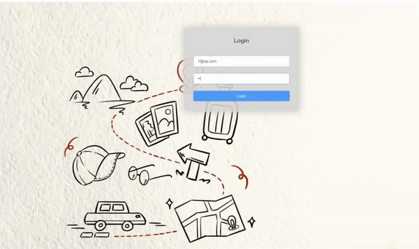
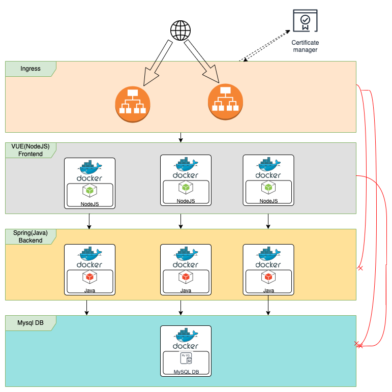
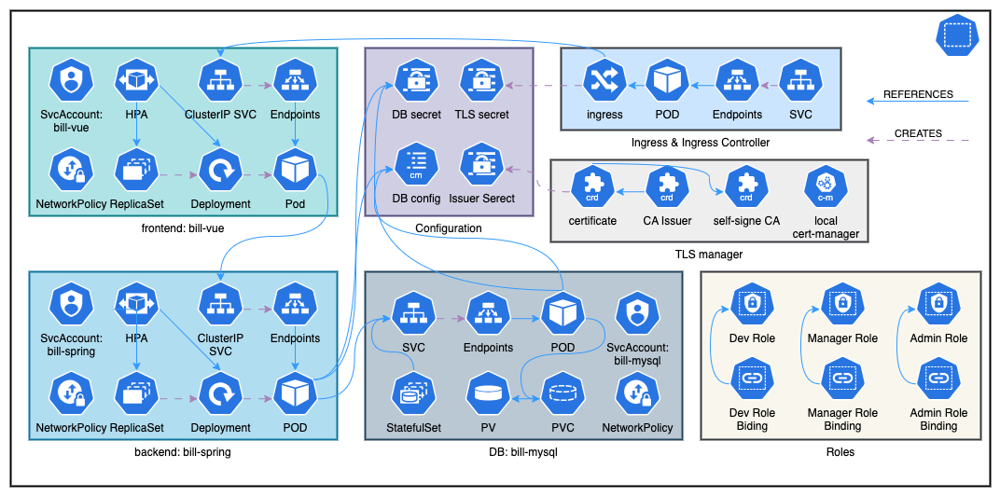
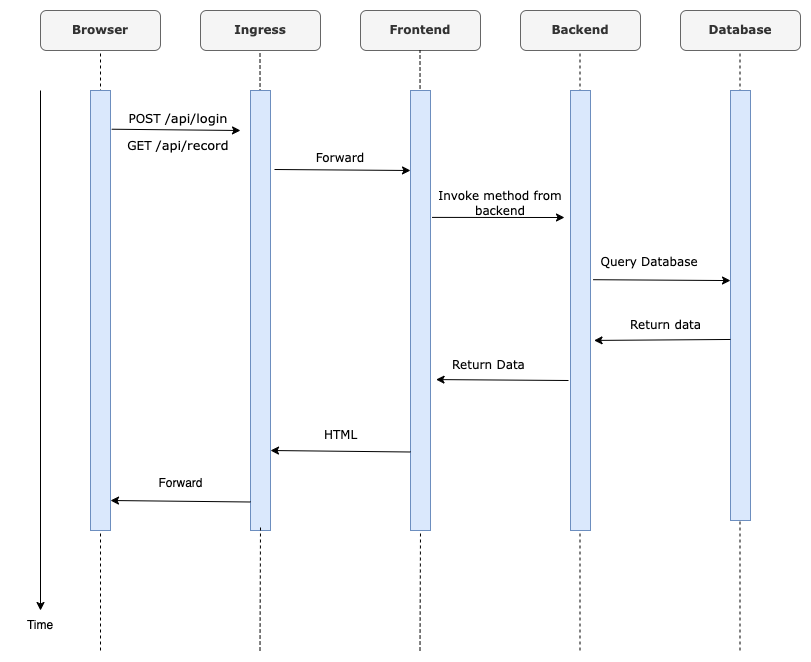

# Journal Bill
This repository houses a comprehensive solution for managing and recording bills throughout your journey.



# Project Components

|  Directory   | Description                                                        |
|--------------|---------------------------------------------------------------|
| bill-backend| The backend, powered by the Spring framework, provides a robust and scalable foundation for handling data. A Dockerfile is included. To build the image, run `sh docker.sh`. or run `docker build -t [imageName]` `docker tag [imageName] [imageName]:[imageTag]` `docker push [imageName]:[imageTag]` |
| bill-frontend |The frontend, using the Vue framework. A docker file is included.  A Dockerfile is included. To build the image, run `docker build -t [imageName]` `docker tag [imageName] [imageName]:[imageTag]` `docker push [imageName]:[imageTag]` |
| bill-helmfile | The component contains all the helm charts, install shell, uninstall shell files. To start our project in GKE or other kubernetes, you can run `sh install.sh`                      |
| bill-mysql   | This components contains init-sql scripts for mysql. If you want to deploy mysql on docker environment, you can run docker-compose.yaml here. |

## Architecture
The architecture of application after the deployment(by helm charts) on GKE is as follows:


The deployment diagram(K8S) is as follows:


In a simple login operation, the sequence is as follows:



## Deployment on GKE
We provide you with an easy script to run on GKE [install.sh](bill-helmfile/install.sh). Or
you can simply execute the commands as
```shell
helm install bill-ingress-controller charts/bill-ingress-controller
helm install bill-cert charts/bill-cert-manager --set leaderElection.namespace=default
sleep 20
helm install bill-issuers charts/bill-cert-issuer
helm install bill-mysql charts/bill-mysql
sleep 10
helm install bill-spring charts/bill-spring
helm install bill-vue charts/bill-vue
helm install bill-nginx charts/bill-nginx
```
If you have change the values under each values.yaml of each chart, run [upgrade.sh](bill-helmfile/upgrade.sh) or
```shell
helm upgrade bill-cert charts/bill-cert-manager
helm upgrade bill-issuers charts/bill-cert-issuer
helm upgrade bill-mysql charts/bill-mysql
helm upgrade bill-spring charts/bill-spring
helm upgrade bill-vue charts/bill-vue
```
To uninstall all the resources, run [uninstall.sh](bill-helmfile/uninstall.sh) or
```shell
helm uninstall bill-nginx
helm uninstall bill-vue
helm uninstall bill-spring
helm uninstall bill-mysql
helm uninstall bill-ingress-controller
helm uninstall bill-issuers
helm uninstall bill-cert
```
To scale the frontend or backend deployment, you can set the values by helm upgrade
```shell
helm upgrade bill-vue charts/bill-vue --set autoscaling.minReplicas=3 --set autoscaling.maxReplicas=4
helm upgrade bill-spring charts/bill-spring --set autoscaling.minReplicas=3 --set autoscaling.maxReplicas=4
```

### Test the network policy
In our Kubernetes configuration, network policies dictate that DB services allow ingress only from resources with the label bill-mysql-client=true,
backend services from bill-spring-client=true, and frontend services from bill-vue-client=true.

To test the network policy, start a pod with shell
```shell
kubectl run --rm --restart=Never --image=alpine -i -t --labels="bill-mysql-client=true" test -- ash
```
Entering the shell, you can test the connection to mysql by `wget -qO- --timeout 1 http://bill-mysql:3306/`.
Then you can change label as
```shell
kubectl run --rm --restart=Never --image=alpine -i -t --labels="bill-mysql-client=false" test -- ash
```
Entering the shell, use the same command `wget -qO- --timeout 1 http://bill-mysql:3306/`, you will get a timeout.

Repeat the steps for bill-spring with test command `wget -qO- --timeout 1 http://bill-spring:8088/`
and bill-vue with `wget -qO- --timeout 1 http://bill-vue:80/`

### Test the RBAC
We define three roles for user `guest` `developer` and `manager`. `guest` has the permission to list/watch/get the
resources, `developer` can list/watch/create/get the resources while `manager` has all the permission. Test the RBAC with
```shell
kubectl auth can-i get pod --as=guest
kubectl auth can-i create pod --as=guest
kubectl auth can-i create pod --as=developer
kubectl auth can-i delete pod --as=developer
kubectl auth can-i delete pod --as=manager
```


# Rolling update and canary update

You can use helm upgrade to set values for rolling update.
For more update operation directly on yaml, check out [k8s-readme](bill-k8s/README.md)

## Experiences

### cert-manager leader election error
When you try to install cert-manager from repository https://charts.jetstack.io on GKE, you may encounter this error:
`E0425 09:04:01.520150       1 leaderelection.go:334] error initially creating leader election record: leases.coordination.k8s.io is forbidden: User "system:serviceaccount:cert-manager:cert-manager-cainjector" cannot create resource "leases" in API group "coordination.k8s.io" in the namespace "kube-system": GKEAutopilot authz: the namespace "kube-system" is managed and the request's verb "create" is denied`
You can check out https://cert-manager.io/docs/installation/compatibility/
The solution is to change the leaderElection namespace by change the values as
```shell
helm install bill-cert charts/bill-cert-manager --set leaderElection.namespace=default
```

### Ingress compatibility between microk8s and GKE
Due to the compatibility, the annotation of ingress in microk8s is `kubernetes.io/ingress.class: public`
while in GKE it is `kubernetes.io/ingress.class: nginx`. For details. check out:

https://stackoverflow.com/questions/54506269/simple-ingress-from-host-with-microk8s

### check service account permission
If you set permission for service account, check this out:
https://stackoverflow.com/questions/54889458/kubernetes-check-serviceaccount-permissions
